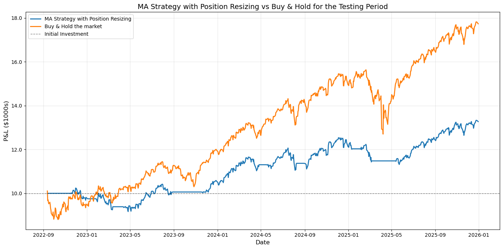
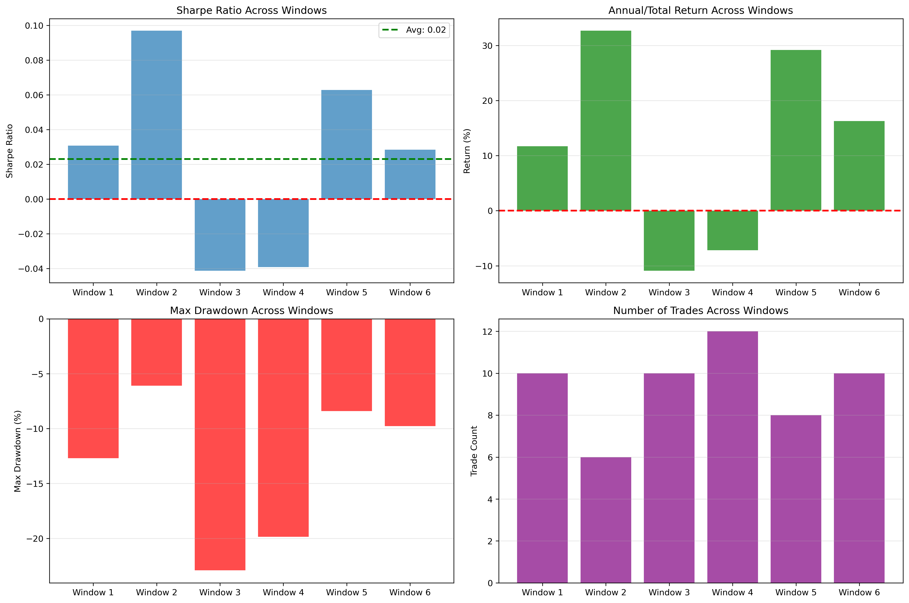
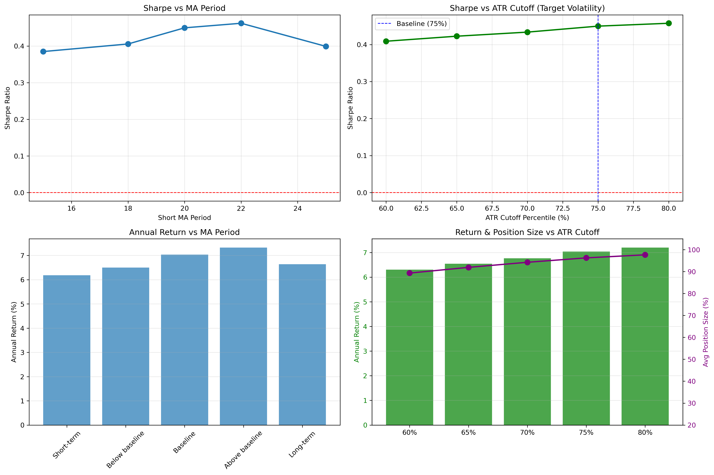
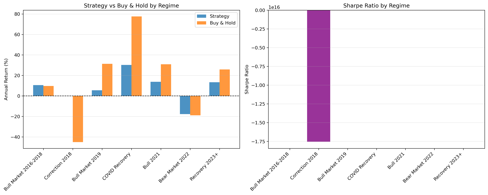
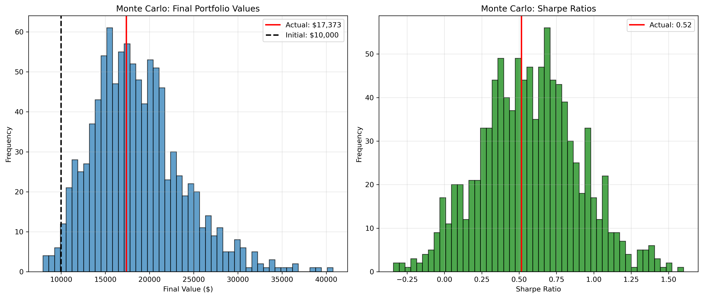

# Moving Average Crossover Strategy & Refinements: Final Report

#### Research question: 
Can a simple moving average crossover strategy be made profitable through refinements, or is the concept fundamentally flawed?

Answer: The underlying concept lacks predictive power on highly liquid assets like SPY.

## Methodology

### Data

- Assets tested: SPY (S&P 500 ETF)

- Period: 2015-2025 (11 years)

- Train/test split: 70/30 (first 70% for development, final 30% for validation)

- Data source: Yahoo Finance via yfinance

  

### Baseline Strategy

- Entry: Buy when 20-day MA crosses above 50-day MA
- Exit: Sell when 20-day MA crosses below 50-day MA
- Rationale for MA(20,50): The traditional MA(50,200) generated insufficient trades (<10 over 11 years). MA(20,50) provides ~25 trades with reasonable holding periods for statistical analysis.
- Position sizing: Fixed $10,000 per trade
- Transaction costs: 0.15% per trade (0.10% commission + 0.05% slippage due to bid-ask spreads and market influence of trades)

### Refinements Tested

1. Volatility filter (ATR-based)
	- Avoid trading during top 30% most volatile periods
	- ATR calculated using 14-day Exponential Moving Average (Wilder's method)
	- Threshold: 75th percentile of ATR as percentage of price (ATRP)
2. Regime detection (trending vs ranging markets)
	- Only trade when market is trending (ADX > 20)
	- Uses Wilder's Average Directional Movement Index (ADX)
	- Rationale: MA crossovers work in trends, fail in ranging markets
3. Dynamic position sizing based on volatility: varying the position size based on volatility
	- Adjust position size inversely to volatility
	- Formula: Position = Capital × (Target_Vol / Current_Vol) - inspired by the Kelly Criterion
	- Target volatility: 75th percentile (reduces only in extreme volatility)
	- Bounds: 25% minimum, 100% maximum

  
### Evaluation Framework

#### I. Core performance metrics 
These are performed for the basic strategy and for every refinement.
- P&L: Total + annualized return, cumulative P&L curve
- Risk-adjusted Performance Ratios: Sharpe Ratio (risk-free rate is the  return rate of the 10 year US bond annualized over the time frame), Information Ratio (compare against S&P 500 returns), Sortino Ratio (penalizes downside volatility only).
- Risk Metrics: Maximum + average drawdown, drawdown duration, volatility
- Trade Statistics: Win Rate (%), Average win vs average loss, Profit factor (gross profit / gross loss), Number of trades, Average holding period
- Strategy beta to benchmark: Alpha (excess return over benchmark), Calmar Ratio (return / max drawdown)
- Return Consistency: Monthly/quarterly return distribution (histogram), Rolling Sharpe ratio, Percentage of positive months/years
- Transaction Cost Sensitivity: Test at multiple cost levels(0 bps, 5 bps, 10 bps, 20 bps), showwhere strategy breaks even
#### II. Robustness testing
Done on the best performing refinement only. 
- Out-of-Sample Check: test strategy on the latter 30% of the data
- Walk-Forward Analysis: 6 expanding window (used ATRP because prices were more volatile during the period 2015 - 2025)
- Parameter sensitivity (MA periods length ±20%, vol threshold ±10%)
- Different market regimes: Test separately on bull/bear/high vol/recovery periods
- Monte Carlo Simulation (1000 simulations)

## Results
### Training Period: 2015-2021

|                       | Baseline Strategy | Refinement 1: Volatility Filter | Refinement 2: Trend Detection | Refinement 3: Position Resizing |
| :-------------------- | :---------------: | ------------------------------: | ----------------------------- | ------------------------------- |
| Final Portfolio Value |     17372.859     |                       15301.783 | 15744.682                     | 16475.420                       |
| Annualized return     |      7.4542%      |                         5.6933% | 6.0866%                       | 6.7149%                         |
| Sharpe w/o costs      |      0.5472       |                          0.4362 | 0.4345                        | 0.5122                          |
| Sharpe w/ costs       |      0.4817       |                          0.3694 | 0.3784                        | 0.4429                          |
| Max Drawdown          |      -21.30%      |                         -17.52% | -21.30%                       | -20.91%                         |
| Avg Drawdown          |      -3.42%       |                          -3.98% | -3.15%                        | -3.45%                          |
| Max Drawdown Duration |    171.00 days    |                     243.00 days | 197.00 days                   | 171.00 days                     |
| Beta                  |      0.3808       |                          0.2962 | 0.3460                        | 0.3538                          |
| Alpha                 |      0.0200       |                          0.0100 | 0.0095                        | 0.0151                          |
| % of Positive Months  |      55.91%       |                          50.54% | 50.54%                        | 55.91%                          |
| Number of Trades      |        36         |                              33 | 30                            | 36                              |

### Out-of-Sample Validation (Test Period: 2022-2025)
Final portfolio value: 13271.214104043822 on 2025-12-30 00:00:00 
Strategy returned 32.712141040438226% from 2022-09-09 00:00:00 to 2025-12-30 00:00:00
Market returned 77.30561272268599 from 2022-09-09 00:00:00 to 2025-12-30 00:00:00

Annualized across 3.3073 years: 
MA Strategy with Position Resizing returned 8.9339% per year
Buy & Hold the market returned 18.9059% per year

### Robustness Testing
On the best performing refinement (ATR Filter) 
#### Walk-Forward Analysis (6 Expanding Windows)

#### Parameter Sensitivity

#### Market Regime Analysis

#### Monte Carlo Simulation (1000 Bootstrap Runs)

## Key Findings
1. MA Crossover Lacks Predictive Power on SPY
The baseline strategy returned 6.0% annually vs 10.8% for buy-and-hold over 2015-2021. This 4.8% annual underperformance compounds to massive wealth destruction over decades.
2. Refinements Cannot Fix a Flawed Signal
Three theoretically-motivated refinements (volatility filter, regime detection, dynamic sizing) all failed to improve risk-adjusted returns. This suggests the problem is signal quality, not execution details.
3. Strategy Works Only in Specific Conditions
Regime analysis revealed the strategy only adds value during sharp corrections (2018 Q4, 2022 bear market) by avoiding worst drawdowns. In all bull market periods, it significantly underperforms.
4. Performance Is Inconsistent Across Time
Walk-forward Sharpe ranged from -0.03 to 0.06 across windows, with high variability (consistency score: 2.95). Monte Carlo simulation confirmed results are statistically indistinguishable from luck.
5. Why Refinements Failed
- Too few signals: With only 35 trades over 6 years, filters either removed good trades or had insufficient data to matter statistically
- Market efficiency: SPY is the most liquid, widely-followed asset globally. Simple technical rules are arbitraged away instantly
- Bull market dominance: 2015-2021 was primarily bullish. Any strategy keeping you out of the market hurts returns

## Conclusion

Question: Can MA crossover be profitable or made profitable through simple refinements?
No, not on highly efficient assets like SPY.
The core issue is that MA crossovers lack predictive power in liquid markets. Refinements cannot improve a fundamentally weak signal. The strategy's only value is downside protection during rare sharp corrections, which doesn't justify its chronic underperformance in all other market conditions.

### What Would Be Improve Profits
- Less efficient assets: Small-cap stocks, emerging markets, or crypto where technical patterns persist longer
- Multiple signals: Ensemble approach combining MA with fundamentals, momentum, and sentiment
- Machine learning: Adaptive models that learn regime-specific patterns
- Different strategy entirely: Mean reversion or statistical arbitrage may work where trend-following fails

### Value of This Research
Despite the negative results, this project showcases
- Rigorous backtesting methodology with proper train/test splits
- Understanding of overfitting risks (didn't optimize parameters to "fix" results)
- Comprehensive robustness testing across multiple dimensions
- Well documented limitations of the strategy and this research

This analysis confirms that passive buy-and-hold investing remains superior to simple technical strategies like MA crossover for efficient markets and bull periods.

## Limitations
- Execution assumptions: Trades assumed at closing prices; real execution at next open would add lag
- Tax implications: Not modeled (significant for frequent trading in taxable accounts)
- Liquidity assumptions: Full execution assumed; valid for SPY but not smaller assets, making the results of this research not necessarily applicable to all assets
- Fractional shares: Allowed in model; not available on all platforms
- Survivorship bias: SPY has survived 30+ years; many ETFs fail
Single asset: Results may not generalize to other assets or asset classes

---

**Final word:** For retail investors seeking SPY exposure, this analysis strongly supports passive index investing over active technical trading. The MA crossover strategy, even with sophisticated refinements, cannot overcome the efficiency of modern equity markets.